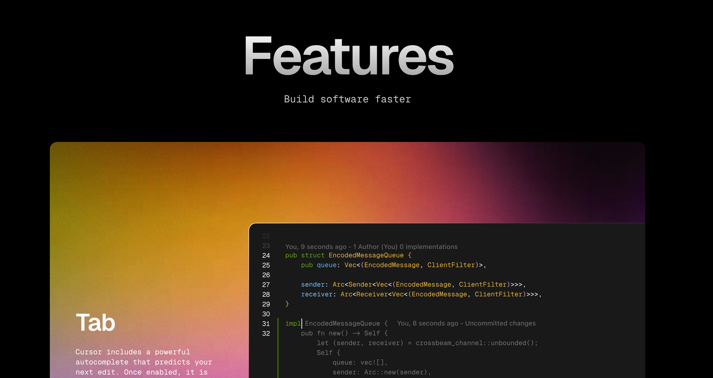
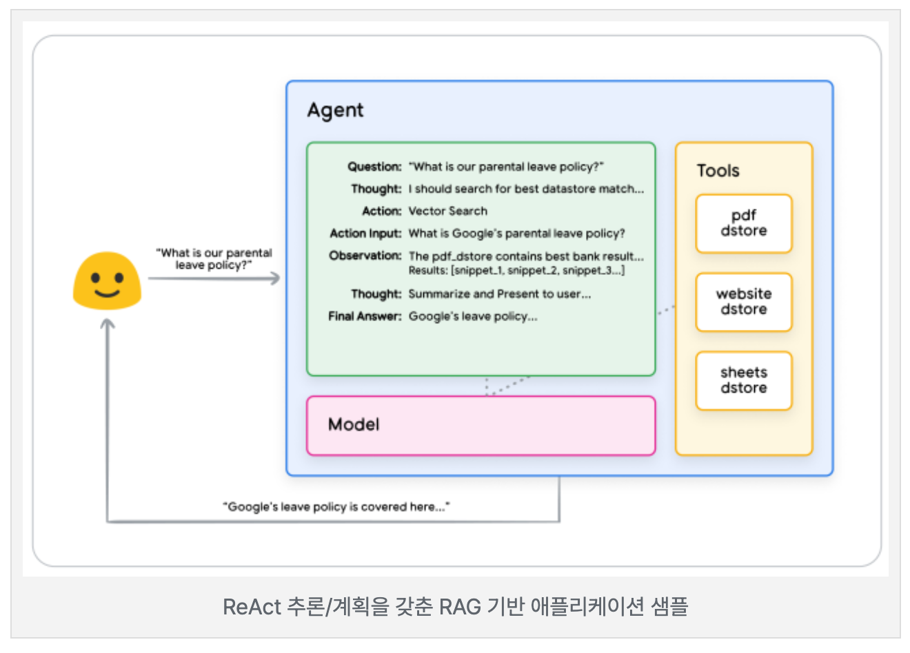

# 2. ChatGPT with Cursor (원데이 클래스) - 구현방법론

- [2. ChatGPT with Cursor (원데이 클래스) - 구현방법론](#2-chatgpt-with-cursor-원데이-클래스---구현방법론)
  - [2.구현 전략](#2구현-전략)
    - [1.Cursor IDE 소개](#1cursor-ide-소개)
      - [Cursor IDE의 가격 정책](#cursor-ide의-가격-정책)
      - [코드 자동 완성 (Tab)](#코드-자동-완성-tab)
      - [AI 채팅 (Chat)](#ai-채팅-chat)
      - [에이전트 (Agent)](#에이전트-agent)
      - [코드 편집 (Ctrl+K)](#코드-편집-ctrlk)
    - [2.Claude 3.5, 3.7, 3.7-thinking 차이점 분석](#2claude-35-37-37-thinking-차이점-분석)
      - [Claude 3.5 Sonnet](#claude-35-sonnet)
      - [Claude 3.7 Sonnet](#claude-37-sonnet)
      - [Claude 3.7-thinking](#claude-37-thinking)
    - [3.AI Agent 소개](#3ai-agent-소개)
    - [4.구현 계획 (with Cursor IDE)](#4구현-계획-with-cursor-ide)

## 2.구현 전략    

### 1.Cursor IDE 소개    
>https://www.cursor.com/features  

   

#### Cursor IDE의 가격 정책
무료 요금제: 기본 IDE 기능, 제한된 AI 기능, 커뮤니티 지원, 개인 사용을 제공합니다.    
프로 요금제: 모든 IDE 기능, 고급 AI 기능, 우선 지원, 전문가용 기능을 제공합니다.   

( 🤖 Ask : 아래 사이트 요약 ( Claude-3.7-sonnet-thinking) )   
[Cursor.com](https://www.cursor.com/features)은 AI 기반 코드 에디터로 다음과 같은 주요 기능을 제공합니다:

#### 코드 자동 완성 (Tab)
- 여러 줄 편집 기능
- 스마트 재작성 (실수 자동 수정)
- 커서 위치 예측

#### AI 채팅 (Chat)
- 코드베이스를 이해하는 AI와 대화
- 인스턴트 적용 (채팅에서 제안된 코드를 바로 적용)
- 코드베이스 질문 (@Codebase 또는 Ctrl+Enter)
- @ 기호로 코드 참조
- 이미지 사용 기능
- @Web으로 웹 검색
- @LibraryName으로 라이브러리 문서 참조

#### 에이전트 (Agent)
- 작업 자동 완료
- 컨텍스트 자동 찾기
- 명령어 자동 실행
- 오류 자동 수정

#### 코드 편집 (Ctrl+K)
- 코드 편집 및 생성
- 터미널에서도 Ctrl+K로 명령어 영어 입력
- 빠른 질문 기능

Cursor는 AI 기반 기능을 통해 개발자의 코딩 속도와 효율성을 높이는 데 중점을 둔 코드 에디터입니다.

### 2.Claude 3.5, 3.7, 3.7-thinking 차이점 분석

  
https://www.anthropic.com/claude/sonnet  

( 🤖 Ask : Claude 3.5, 3.7, 3.7-thinking 차이점 분석 ( Claude-3.7-sonnet-thinking) )  

#### Claude 3.5 Sonnet
- **기본 성능**: 3 시리즈의 발전된 형태
- **강점**: 정확성, 지식 기반 향상
- **컨텍스트**: 약 20만 토큰 처리 가능

#### Claude 3.7 Sonnet
- **성능 향상**: 3.5 대비 추론 및 문제 해결력 대폭 개선
- **코딩 능력**: 획기적으로 발전
- **안정성**: 더 일관되고 정확한 응답

#### Claude 3.7-thinking
- **핵심 차별점**: 사고 과정 투명화
- **특화 기능**: 복잡한 문제에 대한 단계별 추론 과정 표현
- **활용 가치**: 사용자가 AI의 결론 도출 과정을 확인 가능

요약: 3.5→3.7은 전반적 성능 향상, 3.7→3.7-thinking은 추론 과정의 투명성 강화가 핵심 차이점입니다.

### 3.AI Agent 소개  

   

https://modulabs.co.kr/blog/agent-whitepapers-google    
원본 : https://t.co/gAn0gPnNkd    

Cursor IDE 사용자 경험  
- 1.코드베이스를 인덱싱 했는가?  
- 2.질문마다 코드베이스를 적절한 래퍼런스로 삼는가?  
- 3.내 개발환경에 맞는 추천을 잘 해주는가?  
- 4.Agent가 내 의도대로 잘 행동하는가?  

### 4.구현 계획 (with Cursor IDE)  

1.README에 요구사항을 정립    
- 구현할 프로젝트 목표, 기술스택, 구현 Step  
  - 예) 설치 > 서버 코드 > UI 로직 코드 > 마크업 코드 .. 
  - 하나의 기능을 모두 구현하지 않고 단계별로 작성한다.   

2.AI 담당할 부분을 정하기  
- 사람이 하는게 낫다.   
- 모든것을 맡기면 수정 및 사후 검증에 시간이 많이 걸림.   
- eg) AI가 모르는 내용, 간단한 설치 등 

3.순차적으로 구현 및 검증하기  
- 단계별 구현 시작.  

4.Vercel 배포   
- 배포 단계.  
