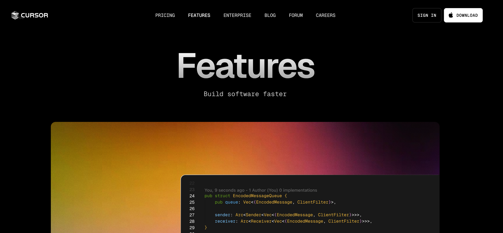

# 3. ChatGPT with Cursor (원데이 클래스) - 개발환경  

- [3. ChatGPT with Cursor (원데이 클래스) - 개발환경](#3-chatgpt-with-cursor-원데이-클래스---개발환경)
  - [3.개발환경 셋팅](#3개발환경-셋팅)
    - [1.Node.js 설치](#1nodejs-설치)
      - [설치 확인](#설치-확인)
    - [2.Cursor IDE 설치](#2cursor-ide-설치)


## 3.개발환경 셋팅  

Node.js란? : Node.js는 Chrome V8 JavaScript 엔진으로 구동되는 서버 사이드 JavaScript 실행 환경입니다.   

### 1.Node.js 설치  

For Mac:
1. Homebrew를 이용한 설치
2. 공식 웹사이트에서 설치 파일 다운로드

For Windows:
1. 공식 웹사이트에서 설치 파일 다운로드
2. 설치 프로그램 실행

Mac 설치

1. **Homebrew 사용**:
   ```bash
   brew install node
   ```

2. **공식 웹사이트 사용**:
   - [nodejs.org](https://nodejs.org)에서 macOS 설치 파일 다운로드
   - 다운로드한 .pkg 파일 실행하고 설치 지침 따르기

Windows 설치

1. **공식 웹사이트 사용**:
   - [nodejs.org](https://nodejs.org)에서 Windows 설치 파일 다운로드
   - 다운로드한 .msi 파일 실행
   - 설치 마법사의 지시에 따라 설치 완료

#### 설치 확인

```bash
node -v
npm -v
```

### 2.Cursor IDE 설치

https://www.cursor.com/  

  

