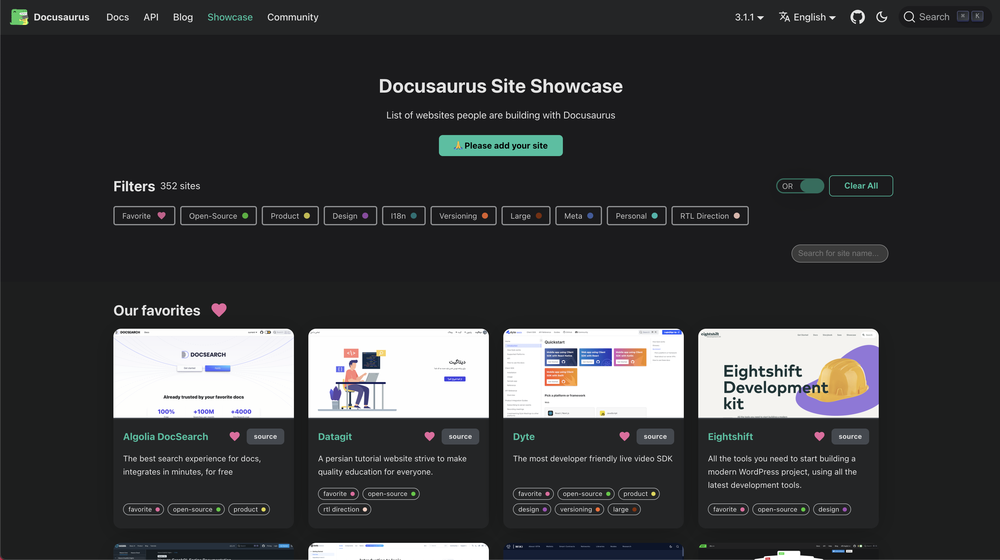
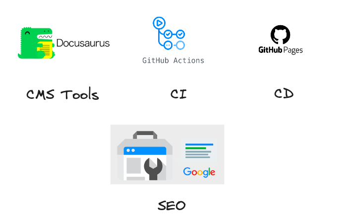

# 0. docusaurus 소개 및 활용 방법

안녕하세요, 여러분! 오늘은 개발자들 사이에서 주목받고 있는 문서 작성 도구인 'Docusaurus'에 대해 알아보겠습니다.  
Docusaurus는 무엇이고, 어떻게 사용되며, 다른 도구들과 비교했을 때 어떤 장단점을 가지고 있는지 알아보도록 하겠습니다.  
또한, Docusaurus를 활용한 블로그 운영에 대한 강의 내용도 함께 살펴보겠습니다.  

## docusaurus 란 ? 

Docusaurus는 페이스북에서 개발한 오픈 소스 문서화 도구로, 주로 개발자들이 프로젝트와 관련된 문서를 쉽게 작성하고 유지보수할 수 있도록 도와줍니다.  
React 기반으로 만들어져 있어 사용이 간편하며, 멋진 문서화 페이지를 손쉽게 만들 수 있습니다.

## docusaurus 사용 사례

Docusaurus는 다양한 분야에서 사용되고 있습니다. 주로 기술적인 문서 작성에 활용되지만, 공식 문서, 블로그, 개발자 커뮤니티 사이트 등에서도 많이 사용되고 있습니다.  
- Facebook, Microsoft, Twitter 등 대형 기업들도 Docusaurus를 채택하여 문서화에 활용하고 있습니다.

showcase 보러가기 > https://docusaurus.io/showcase  
- eg) https://supabase.com/docs  
- eg) https://create-react-app.dev/ 

## docusaurus 사용목적

여러가지 문서화 도구가 있지만, docusaurus를 고른 이유는 다음과 같습니다.   

1. Markdown 기반  
- 문서화는 Markdown이 가장 가볍고 효과적이라 생각.  
- 특히나 많은 개발지식을 다루는데 있어서, 가볍고 타이핑하기 좋은게 최고  
- (사진 정도는 쉽게 넣을 수 있으며, 이모티콘, html코드, js플러그인 등은 문서화 작업의 범위를 벗어남 )  

2. SEO 가능  
- 정적 Html 파일 생성이 가능하며, 이는 SEO에 유입에 좋음  
- 혼자서 보관하는 용도 + 다른 사람들에게 나의 지식을 보여줄 수 있음  

3. git으로 형상관리
- 특정 블로그에 종속될 필요가 없다.  
- 마크다운으로 글의 소스를 버전 관리할 수 있다.  

4. CI/CD 가능   
- github action을 이용해서 gh-pages에 배포할 수 있다.  

5. React + Typescript 사용 가능  
- 필요하다면 리액트 컴포넌트를 도입해서 개발 가능.  

### Blog Best Practice 

아래 사이트는 docusaurus 만들지는 않았지만 사이트 운용 전략 관점에서 보자.  

daleseo > https://www.daleseo.com/  
- 사용자 유입 많음 / 가독성 높은 글 쓰는 방법
  
벨로퍼트와 함께하는 모던 리액트 > https://react.vlpt.us/   
- 튜토리얼 형식의 기술 정리  

캡틴판교 블로그 > https://joshua1988.github.io/   
> https://joshua1988.github.io/webpack-guide/. 
- 마켓팅 퍼널 만들기, SEO + 오가닉 유입을 세일즈로 연동    

## 비교 및 장단점 정리 : Notion, OneNote, 블로그

docusaurus의 사용 목적 외 다른 문서화 도구를 가져가면 좋다.   
모든 니즈를 충족시켜주는 만능 도구는 없다.  

### Notion. 

장점
- 협업이 많이 필요하면 Notion을 사용하는것이 좋다.  
- 일정관리, 테스크 관리, 캘린더 관리, 설문조사 연동 등  

단점 
- SEO 어려움, 느린 로딩, 유료 플랜    

### OneNote.  

장점  
- PPT,PDF 업로드 등 방대한 자료를 저장할 수 있다.   
- 나만 볼 수 있는 성능 좋은 강의 노트로 적합하다.    

단점
  - 공유를 통해 공통 작업하기에 어렵다.  
  - SEO는 불가능하다.  

### 블로그  

장점
- 해당 플랫폼의 트래픽을 받을 수 있는 장점이 있다.   
- Tistory, Velog 등 사용  

단점  
 - 글 관리가 어렵다. ( 글이 100개 이상이면 어떤 글이 있는지 형상관리가 어렵다.)  

## 강의를 통해서 얻어 갈 내용

- **기본 설정 및 설치:** Docusaurus를 설치하고 기본 설정하는 방법에 대한 안내.  
- **Markdown 활용:** Markdown을 통한 효과적인 글 작성 방법과 문서 스타일링.   
- **React 컴포넌트 활용:** React를 활용하여 블로그 페이지를 개발하고 커스터마이징하는 방법.  
- **SEO 최적화:** Docusaurus의 SEO 기능을 활용하여 블로그를 검색 엔진에 최적화하는 방법.  
- **CI/CD 구축** CI = github actions, CD = github pages 사용하여 배포하는 방법.    

Repo : https://github.com/7code-group/7code-group.github.io  
Live : https://7code-group.github.io

