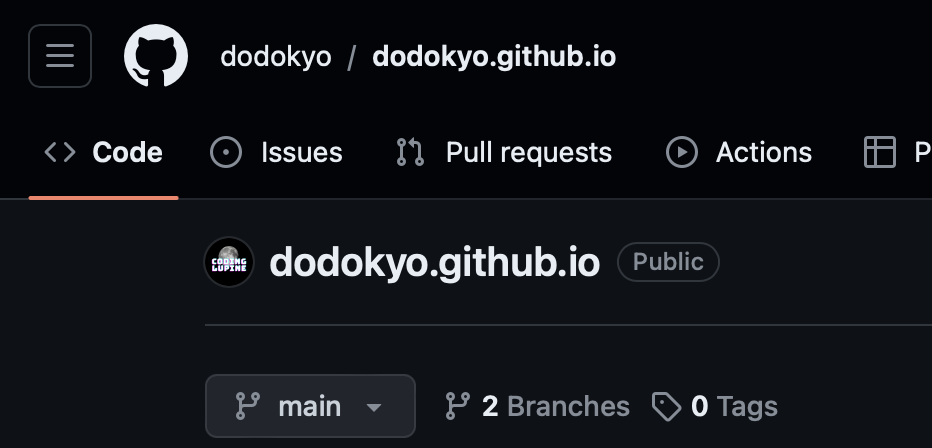
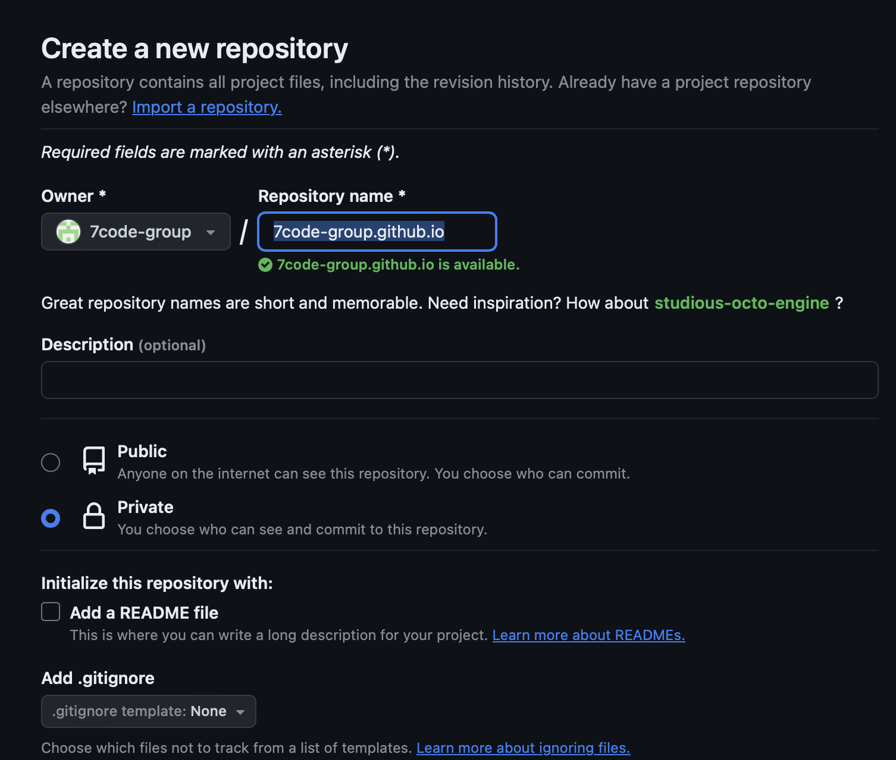

# 1. docusaurus 설치


공식문서 > https://docusaurus.io/docs  

## gitrepo 생성


2가지 종류로 래포를 만들 수 있다.  

1.내 아이디 + github.io 
- 예) dodokyo.github.io 
- >gh-pages 배포 후 dodokyo.github.io 주소는 내 블로그가 된다.  

2.평범한 래포 이름  
- my-blog라는 래포를 만들면
- >gh-pages 배포 후 dodokyo.github.io/my-blog 라는 subpath가 내 블로그가 된다.  

여기서는 1번 방법을 사용  



## Install 

```
// node.js 설치
node -v

// create project
npx create-docusaurus@3.1.1 my-website classic

// start
cd ./my-website
> "start": "docusaurus start --host 0.0.0.0",
yarn start

```


