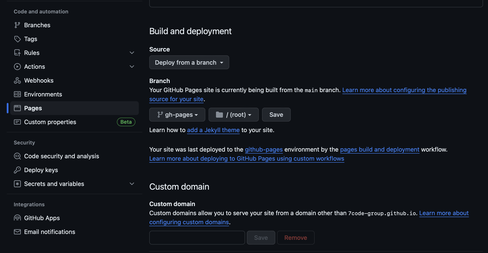

# 2. docusaurus 배포

## github actions 이란?

GitHub Actions는 GitHub에서 제공하는 자동화 서비스
- 코드를 빌드, 테스트, 배포하는 등의 작업을 자동으로 수행할 수 있는 도구입니다 (CI)
- Github Pages에 배포가 가능 (CD)
- GitHub Actions는 간단한 YAML 문법을 사용하여 워크플로우를 정의  
- `.github/workflows` 디렉토리에 워크플로우를 정의하여 설정  


```yml
name: Workflow 이름

on:
  event:
    - 조건1
    - 조건2

jobs:
  job이름:
    name: Job 이름
    runs-on: runner 환경

    steps:
      - name: Step 1
        run: 실행 명령어

      - name: Step 2
        run: 실행 명령어
---
name: CI

on:
  push:
    branches:
      - main

jobs:
  build:
    name: Build and Test
    runs-on: ubuntu-latest

    steps:
      - name: Checkout Repository
        uses: actions/checkout@v2

      - name: Setup Node.js
        uses: actions/setup-node@v3
        with:
          node-version: 14

      - name: Install Dependencies
        run: npm install

      - name: Run Tests
        run: npm test

```

### Point.  
- 코드에 대한 형상 관리 (md파일 포함) => github  
- CI/CD에 대한 형상 관리 = workflows 코드 자체를 관리 => github  
- CI/CD 수행 = github actions  


## github actions 적용

https://docusaurus.io/docs/deployment#triggering-deployment-with-github-actions


### Process


### 시나리오  

1. docusaurus 문서 발행. 
2. 커밋 및 저장소 push > Event.   
3. github actions 발동 > 워크플로우 시작  
4. gh-pages 에 자동으로 배포  


## github repo init 

```
// git init & commit 
git init
git remote add upstream git@github.com-dodokyo:7code-group/7code-group.github.io.git
git add --all . 
git commit -m "init"
git push upstream main
```

## github actions workflow 추가

공식문서의 내용을 아래에 경로에 붙여 넣자.  
- .github/workflows/deploy.yml
- 해당 파일이 있으므로 github는 actions을 발동한다.  


```yml
name: Deploy to GitHub Pages

on:
  push:
    branches:
      - main
    # Review gh actions docs if you want to further define triggers, paths, etc
    # https://docs.github.com/en/actions/using-workflows/workflow-syntax-for-github-actions#on

permissions:
  contents: write

jobs:
  deploy:
    name: Deploy to GitHub Pages
    runs-on: ubuntu-latest
    steps:
      - uses: actions/checkout@v4
        with:
          fetch-depth: 0
      - uses: actions/setup-node@v4
        with:
          node-version: 18
          cache: yarn

      - name: Install dependencies
        run: yarn install --frozen-lockfile
      - name: Build website
        run: yarn build

      # Popular action to deploy to GitHub Pages:
      # Docs: https://github.com/peaceiris/actions-gh-pages#%EF%B8%8F-docusaurus
      - name: Deploy to GitHub Pages
        uses: peaceiris/actions-gh-pages@v3
        with:
          github_token: ${{ secrets.GITHUB_TOKEN }}
          # Build output to publish to the `gh-pages` branch:
          publish_dir: ./build
          # The following lines assign commit authorship to the official
          # GH-Actions bot for deploys to `gh-pages` branch:
          # https://github.com/actions/checkout/issues/13#issuecomment-724415212
          # The GH actions bot is used by default if you didn't specify the two fields.
          # You can swap them out with your own user credentials.
          user_name: github-actions[bot]
          user_email: 41898282+github-actions[bot]@users.noreply.github.com
```


## github setting 

### [1] GITHUB_TOKEN 권한

GITHUB_TOKEN 은 자동으로 발급되는데, 기본 권한은 readonly 이다.    
repo에 gh-pages branch를 만들고 푸쉬 하도록 쓰기 권한을 부여하자.  

프로젝트 레파지토리 > Settings > Actions 탭의 General > Workflow permissions 항목에서  
- Read and write permissions 으로 변경하자.


### [2] gh-pages branch 설정  

아래 설정을 하지 않으면, README.md가 나온다. CI과정을 거쳐 gh-pages라는 브랜치로 배포가 되니 설정을 변경하자.

project setting > pages > github pages > branch > gh-pages가 나온다.




## gh-pages 확인

페이지 접속 : nickname.github.io 

### 트러블 슈팅: baseUrl 관련 오류

> docusaurus.config.js 변경
github repo이름이 myname.github.io 이 아닌 커스텀 이름인 경우  
- 다음처럼 내 래포 이름(hello-world-docusaurus)으로 변경한다.  
  baseUrl: "/hello-world-docusaurus/",  

