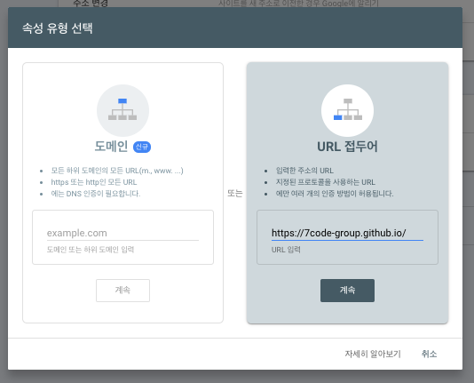

# 3.3 SEO 처리


## Google Search Console?

- 웹사이트의 검색 성과를 모니터링하고 최적화할 수 있도록 도와주는 무료 도구. 
- 사람들이 구글검색을 통해서 내 사이트에 오게 만들려면, 서치콘솔 등록은 필수이다.  

## 1.install(필요없음)  


preset-classic 으로 프로젝트를 생성 했으므로 아래 패키지는 설치할 필요 없다.  
- *그렇지 않다면 설치 진행.  
```
yarn add @docusaurus/plugin-google-gtag @docusaurus/plugin-sitemap
```

문서 : https://docusaurus.io/docs/api/plugins/@docusaurus/plugin-sitemap  


### trailingSlash

trailingSlash 설정을 false을 주면 url에 index.html이 빠진다.  
- 차이점은 변환 방식이다. > ( index.html vs myDoc.html )

```
docusaurus.config.js
{
...
  trailingSlash:false,
...
}

---
undefined (default): keeps URLs untouched, and emit /docs/myDoc/index.html for /docs/myDoc.md

true: add trailing slashes to URLs/links, and emit /docs/myDoc/index.html for /docs/myDoc.md

false: remove trailing slashes from URLs/links, and emit /docs/myDoc.html for /docs/myDoc.md
```

### 사이트맵 확인

[1] 사이트맵 수집 오류 해결

docusaurus.config.js
```
  // Set the production url of your site here
  url: "https://nickname.github.io",
```

[2]
sitemap.xml 접속 후 확인

### robots.txt 추가

- static/robots.txt 하위 경로에 추가한다.

```
User-agent: *
Allow: /

Sitemap: https://nickname.github.io/sitemap.xml
```

## 2.Search Console 등록





```js
docusaurus.config.js

...
  themeConfig:
    /** @type {import('@docusaurus/preset-classic').ThemeConfig} */
    ({
      // Replace with your project's social card
      image: 'img/docusaurus-social-card.jpg',
      metadata:[{
        name:"google-site-verification", 
        content:"Ov_hk6LqaaE5KiwXnqF2gTKwPxBE3qG5Zr3o5UWZXc8"
      }],
```


### Sitemap.xml 제출하기  

## 3.SEO Guide

Guide > https://docusaurus.io/docs/seo