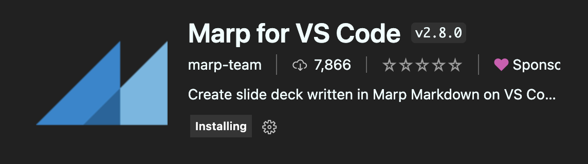

# 4.확장 운용하기

- [4.확장 운용하기](#4확장-운용하기)
  - [4.1 markdown all in one](#41-markdown-all-in-one)
  - [4.2 excalidraw](#42-excalidraw)
    - [excalidraw ?](#excalidraw-)
    - [install extension for editor](#install-extension-for-editor)
    - [usage](#usage)
  - [4.3 marp](#43-marp)
    - [marp란 ?](#marp란-)
    - [install extension for viewer](#install-extension-for-viewer)
  - [4.4 마치며](#44-마치며)


## 4.1 markdown all in one


마크다운 작성에 도움되는 명령어가 있음.  
대표적으로 Table Of Content 생성

```
CMD + Shift + P 로 아래 처럼 검색

```


## 4.2 excalidraw

### excalidraw ? 

draw.io 와 같은 업을 위한 실시간 그림 그리기 도구  

### install extension for editor


### usage

아래와 같은 확장자로 파일을 만들어주면 excalidraw 

```
.excalidraw, .excalidraw.json, .excalidraw.svg or .excalidraw.png 
- open it in Visual Studio Code.
```

## 4.3 marp

### marp란 ?

Markdown으로 PPT를 만들 수 있는 도구  

### install extension for viewer



```
# install
yarn add @marp-team/marp-cli cpy-cli

# add scripts
---
  "scripts": {
    ...
    "copy-images": "cpy \"./docs/marp/**/*.{jpg,png}\" \"./static/marp\"",
    "build:marp": "marp --html -I ./docs/marp -o ./static/marp/ && yarn copy-images"
```


## 4.4 마치며

지금까지 Docusaurus를 통한 개발자 기술 블로그 운용 방법에 대해서 알아봤습니다.   
앞으로 개발자로 성장하는데 있어서 방대한 지식들을 정리하는 보조 뇌로 잘 활용하길 바라겠습니다. ~ 

디벨롭 방향  
- github actions + pages 대신, AWS + Docker Container + Portainer 조합으로 직접 CI/CD 구축해보기  
- ghost admin, wordpress API 등과 연동    

