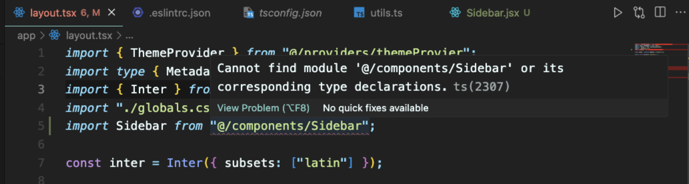
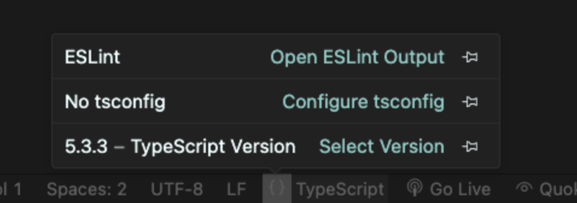

# 2.NextJS 설치하기

## 1. 코딩 결과물 미리보기  

## 2 개발환경구축

### IDE + Node.js 설치하기

- VSCode 설치 > https://code.visualstudio.com/.  
- node.js 설치 > https://nodejs.org/en.  
- yarn 설치 ``` npm install yarn -g ```.  

### vscode extension 설치 목록  

https://open-vsx.org/extension/dsznajder/es7-react-js-snippets.  
https://open-vsx.org/extension/dbaeumer/vscode-eslint.  
https://open-vsx.org/extension/esbenp/prettier-vscode.  
https://open-vsx.org/extension/oderwat/indent-rainbow.  
https://open-vsx.org/extension/bradlc/vscode-tailwindcss.  

### vscode setting.  

- Format On Save
- trigger suggest 


## 3.NextJS 설치

### Install

```
# 1 nextjs 프로젝트 시작하기
npx create-next-app@14.1.4

# 2. 필요한 패키지 미리 설치
( version issue에 대응하여 특정 버전으로 설치하기 )   
yarn add react-spinners@^0.13.8
yarn add react-icons@^5.0.1
yarn add @supabase/supabase-js@^2.42.0
yarn add @supabase/ssr@^0.1.0
yarn add @supabase/auth-ui-react@^0.4.7
yarn add @supabase/auth-ui-shared@^0.1.8
yarn add cookies-next@^4.1.1

-- @supabase/supabase-js : @supabase/ssr에서 사용하는 모듈, 설치 안하면 타입자동완성이 안된다.   


```
### Config

```
1.tsconfig.json
- js,jsx 추가

  ...
  "include": [
    "next-env.d.ts",
    "**/*.ts",
    "**/*.tsx",
    "**/*.js",
    "**/*.jsx",
    ".next/types/**/*.ts"
  ],

2.tailwind.config.ts
- js,jsx 추가

  content: [
    "./pages/**/*.{ts,tsx,jsx,js}",
    "./components/**/*.{ts,tsx,jsx,js}",
    "./app/**/*.{ts,tsx,jsx,js}",
    "./src/**/*.{ts,tsx,jsx,js}",
  ],
```


### Nextjs 실행 및 github 레파지토리 올리기  

- github 올리기
- window : https://codechacha.com/ko/git-add-ssh-key-in-windows/
- mac : https://data-jj.tistory.com/78#google_vignette


## 4.(보충) github SSH키 등록법

## 5.(보충) VSCode Typescript 애러 해결

### 애러) TS버전 선택 이슈  


1) 아무 .ts파일 열기 > 위 사진처럼 Typescript 옵션이 보임 > 버전 선택 > 현재 프로젝트

### 애러) Cannot find module해결 방법

 

1) 위 그림의 No tsconfig 경로 문제입니다.



2) tsconfig 파일에 공백을 하나 추가하고 다시 저장해주시면 포멧팅이 되며 해결 됩니다.   
*혹은 경로를 재설정 해주세요.  

---

## 6.라이브러리, 툴 소개


1. **Next.js 14:**
   - Next.js는 React 기반의 웹 프레임워크로, SSR(Server-Side Rendering) 및 정적 사이트 생성을 지원
   - https://nextjs.org/  

2. **Tailwind CSS:**
   - Tailwind CSS는 클래스 기반의 유틸리티 퍼스트(CSS Utility-First) 프레임워크
   - HTML 클래스에 직접 스타일을 적용하여 디자인을 구축
   - https://tailwindcss.com/docs/installation

3. **React-Spinners, React-Icons**
   - React-Spinners는 리액트 애플리케이션에서 로딩 스피너
   - React-Icons는 다양한 아이콘
   - https://ui.shadcn.com/


```
yarn add react-spinners@^0.13.8  
- 동적 로딩 아이콘  
yarn add react-icons@^5.0.1  
- 아이콘  

yarn add @supabase/supabase-js@^2.42.0  
- JS SDK
yarn add @supabase/ssr@^0.1.0  
- Next, Nuxt, Remix 등 SSR JS SDK  
- @supabase/supabase-js 대신 사용한다.  

yarn add @supabase/auth-ui-react@^0.4.7
- 로그인 패스트 구현  
yarn add @supabase/auth-ui-shared@^0.1.8
- 로그인 UI 디자인    

yarn add cookies-next@^4.1.1  
- 좀 더 쉽게 쿠키 다루기   

```