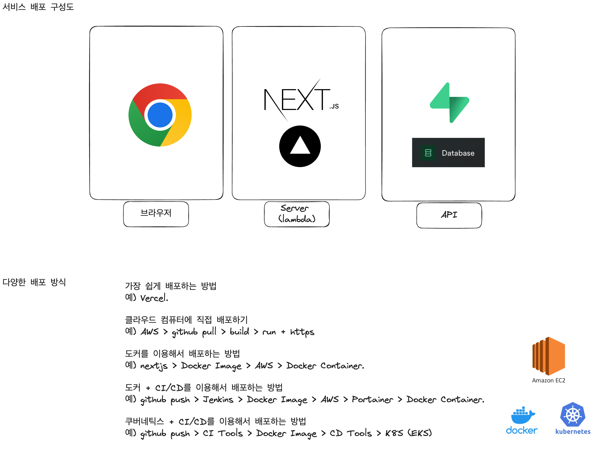

# 3.NextJS 배포하기


Goal  
- Next.js Vercel에 배포하고 다른 배포 방식을 이해합니다.  

## 1	Vercel 배포하기  

초기 셋팅한 프로젝트를 Vercel을 통해서 세상에 공개 해 보세요. 
- 단, supabase 연동 후 환경변수 오류로 제대로 동작하지 않을거에요.  
- 후반부에 이를 해결하는 방법을 배우게 됩니다.  

## 2	다양한 배포 방식 (CI/CD)


  

```
가장 쉽게 배포하는 방법
예) Vercel.

클라우드 컴퓨터에 직접 배포하기
예) AWS > github pull > build > run + https

도커를 이용해서 배포하는 방법
예) nextjs > Docker Image > AWS > Docker Container.

도커 + CI/CD를 이용해서 배포하는 방법
예) github push > Jenkins > Docker Image > AWS > Portainer > Docker Container.

쿠버네틱스 + CI/CD를 이용해서 배포하는 방법 
예) github push > CI Tools > Docker Image > CD Tools > K8S (EKS)
```

### 🤖GPT Comment. 각각의 배포 방식에 대해 설명해드리겠습니다:

1. **가장 쉽게 배포하는 방법 (예: Vercel)**:
   - 이 방법은 배포를 매우 간단하게 만들어줍니다. 대부분의 경우, 코드를 Vercel에 업로드하면 Vercel이 자동으로 빌드하고 호스팅해줍니다. 
   - 개발자들은 서버 설정, 인프라 관리 등과 같은 복잡한 작업을 걱정할 필요 없이 애플리케이션을 쉽게 배포할 수 있습니다.

2. **클라우드 컴퓨터에 직접 배포하기 (예: AWS > GitHub Pull > Build > Run + HTTPS)**:
   - 이 방법은 애플리케이션을 클라우드 서비스 (예: AWS)에 직접 배포하는 방법입니다.
   - 주로 GitHub 등의 소스 코드 저장소를 통해 코드를 가져와서 빌드하고, 클라우드 서비스에서 실행합니다.
   - HTTPS를 구성하기 위해 SSL 인증서를 설정하고 관리해야 합니다.

3. **도커를 이용해서 배포하는 방법 (예: Next.js > Docker Image > AWS > Docker Container)**:
   - 이 방법은 도커 컨테이너를 사용하여 애플리케이션을 패키징하고 배포하는 방법입니다.
   - 개발자는 애플리케이션과 필요한 종속성을 포함한 도커 이미지를 빌드하고, 클라우드 환경에서 도커 컨테이너를 실행합니다.

4. **도커 + CI/CD를 이용해서 배포하는 방법 (예: GitHub Push > Jenkins > Docker Image > AWS > Portainer > Docker Container)**:
   - 이 방법은 도커를 사용하여 애플리케이션을 패키징하고, CI/CD 파이프라인을 통해 자동으로 배포하는 방법입니다.
   - 소스 코드가 GitHub에 푸시되면 Jenkins 또는 다른 CI 도구가 트리거되어 빌드 및 테스트를 수행하고, 도커 이미지를 빌드하여 저장소에 업로드합니다. 
   - 이후, Portainer와 같은 도커 관리 도구를 사용하여 클라우드 서비스에서 도커 컨테이너를 실행합니다.

5. **쿠버네티스 + CI/CD를 이용해서 배포하는 방법 (예: GitHub Push > CI Tools > Docker Image > CD Tools > K8S (EKS))**:
   - 이 방법은 쿠버네티스 (Kubernetes)와 CI/CD 도구를 사용하여 애플리케이션을 배포하는 방법입니다.
   - 소스 코드가 GitHub에 푸시되면 CI 도구가 트리거되어 테스트 및 빌드를 수행하고, Docker 이미지를 빌드합니다.
   - CD 도구는 Kubernetes 클러스터에 배포를 자동화하여 애플리케이션의 확장성과 안정성을 유지하고 관리합니다.

각 방법은 다양한 사용 사례와 요구 사항에 맞게 선택될 수 있습니다. 개발자는 자신의 프로젝트에 가장 적합한 배포 전략을 선택할 수 있습니다.
