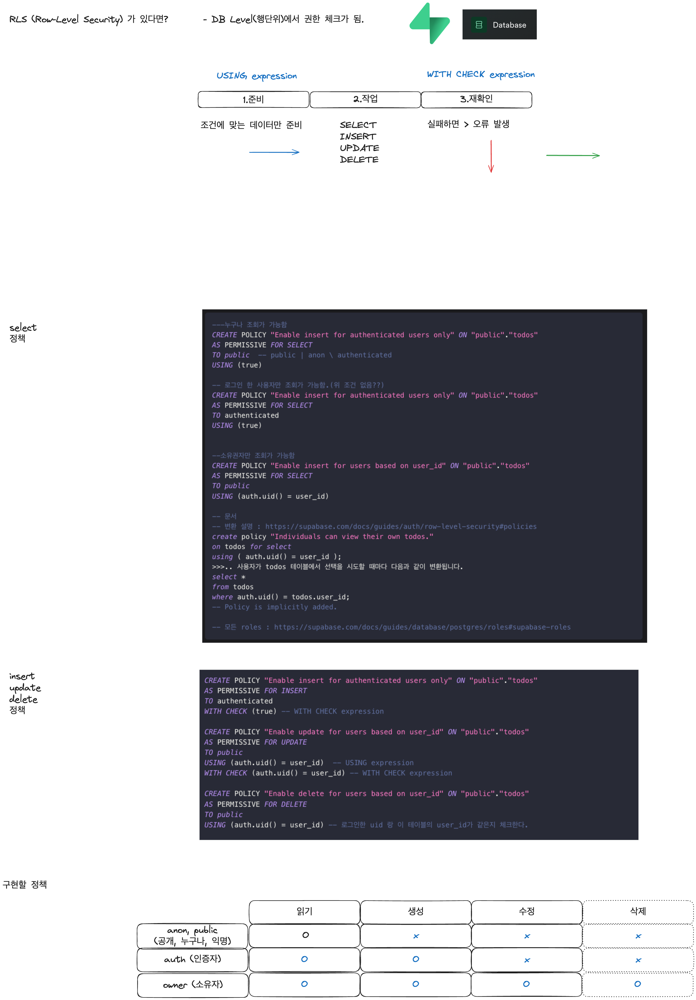

# 8.TodoList with RLS, ServerActions

Goal  
- TodoList를 구현합니다.  아래 조건을 포함해요.  
  - RLS 정책 설정  
  - Server Side에서 CRUD  처리 with ServerActions  

## 1 TodoList Table 만들기 with RLS  

지난 시간에는 브라우저에서 TodoList를 CRUD 했어요. 이번에는 모두 서버측에서 처리해 볼까요?  

## 2 RLS 정책 구현계획  

  

## 3 Select, Insert, Update, Delete RLS 정책 만들기  

## 4 Server Actions CRUD 로직, RLS 테스트  

## 5 AuthHeader  

## 6 사용자 정보 가져오기  

## 7 테스트 및 오류수정  

