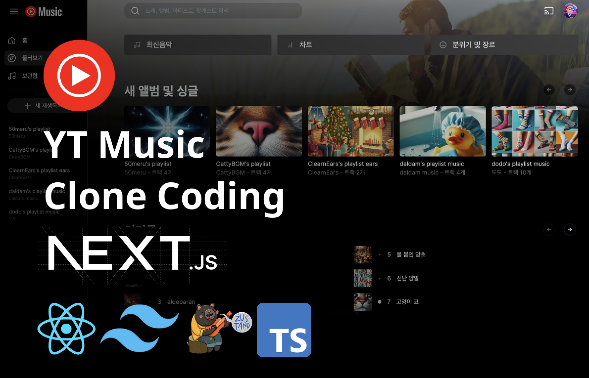
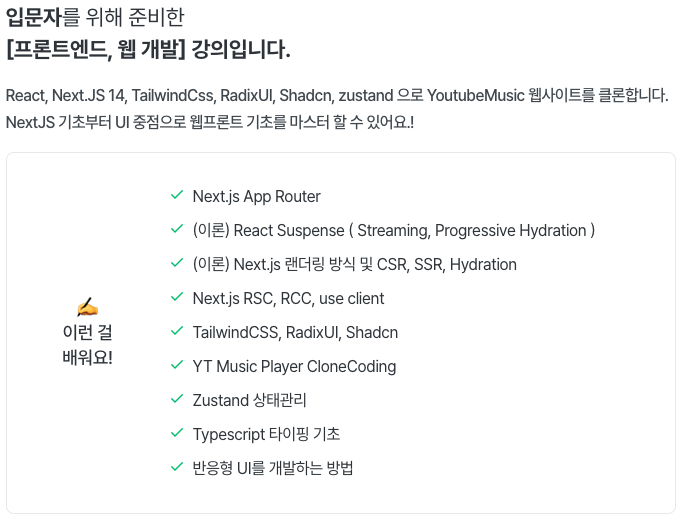
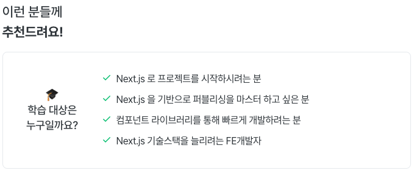
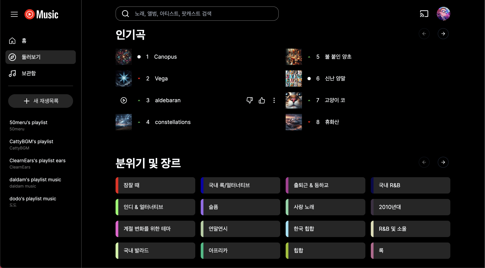
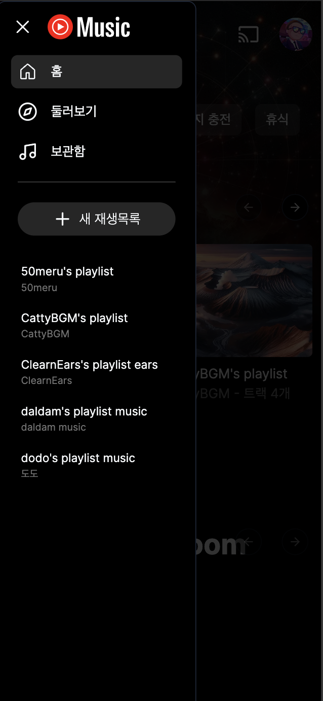
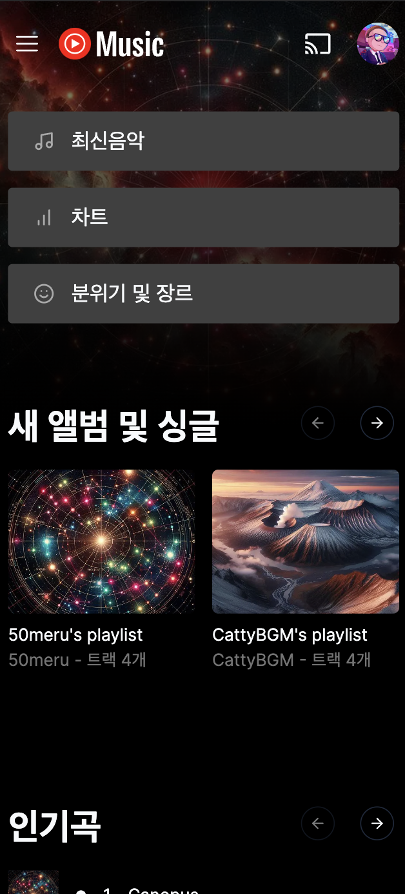
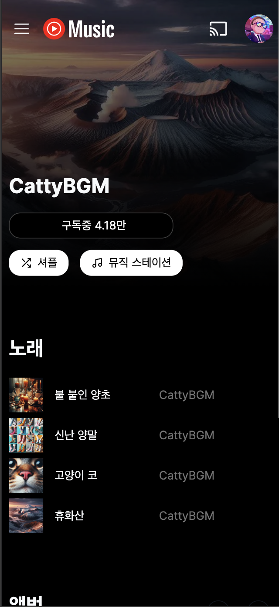
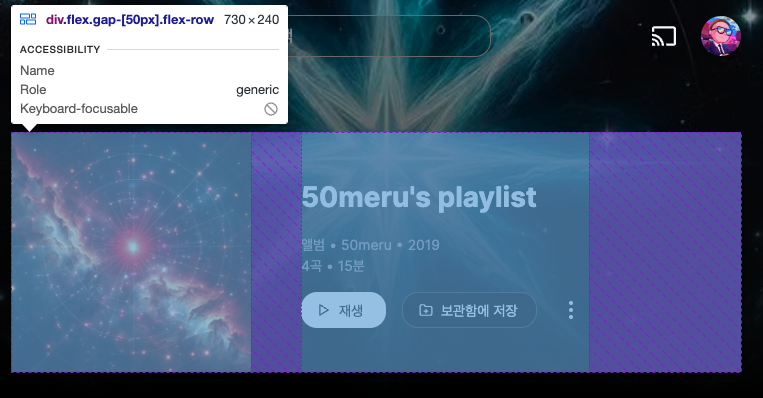

# 0.기초부터 배우는 Next YTMusic 클론 코딩 소개





## 1. 완성본 미리 보기

LiveDemo : https://yt-music-clone-six.vercel.app/

### PC





### Mobile

|Drawer|Explore|Channel|
|------|---|---|
||||

## 2.TechStack & Tools

```
React
Next.js 14 AppRouter
TailwindCss
RadixUI
Shadcn
zustand
react-spinners
react-icons  
```

## 3.강의 필기 노트 안내  


[강의필기노트📌](https://dodokyo.github.io/docs/category/nextjs-yt-music-%ED%81%B4%EB%A1%A0%EC%BD%94%EB%94%A9-)  

- 각 챕터별 Goal : 강의 목표 안내  
- 각 챕터별 복습 포인트 : 복습해야 할 컴포넌트 단위 안내    
- 각 챕터별 더 알아보기 (공식문서, 개념 등) : 더 공부할 문서 안내    
- 각 챕터별 고도화 : 성능개선 및 최적화 Point 안내  

## 4.공부 방법 🌼🌼🌼🌼

이 강의는 클론코딩이 메인 입니다.  
강의를 보면서 따라치는것도 좋지만, 그냥 보면서 이해하고 넘어가도 좋습니다.   
그러나 반드시 내것으로 만드는 체화 과정이 필요합니다.   

### 체화 

체화를 잘 끝내셨더라면 2가지가 머리속(혹은 노트)가 남습니다.  

1.각 핵심기술 컨셉에 대한 사용 목적, 사용 방법, 예시 코드, 참고 래퍼런스  
2.핵심요약을 바탕으로 YoutubeMusic 이든, Spotify든, gmail이든 FE화면은 구현할 수 있어야 함.  


### 추천하는 방법
1.강의를 빠르게 배속으로 본다.  
(이론적인 부분들은 완벽하지 않더라도 이해만 하고 넘어간다.)  
2.코딩 부분은 하나의 컴포넌트(구현체) 단위로 복습을 진행한다.  
3.일부의 컴포넌트(구현체)를 안보고 그대로 재현한다.  
4.재현에 필요한 개념들은 따로 정리해도 좋다.  

예)  


재현에 필요한 개념  
- flex, font-size, color, margin 등 css 개념   
- react component 만들기  
- next Image 컴포넌트 사용법  
- 아이콘 고르고 import하는 방법  


## 5.강의 체크포인트 안내  

- 아래 브랜치를 통해서 각 챕터별 체크포인트를 확인할 수 있습니다.  

https://github.com/dodokyo/yt-music-clone/tree/ch4-done  
https://github.com/dodokyo/yt-music-clone/tree/ch5-done  
https://github.com/dodokyo/yt-music-clone/tree/ch6-done  
https://github.com/dodokyo/yt-music-clone/tree/ch7-done  
https://github.com/dodokyo/yt-music-clone/tree/ch8-done  
https://github.com/dodokyo/yt-music-clone/tree/ch9-done  
https://github.com/dodokyo/yt-music-clone/tree/ch10-done  
https://github.com/dodokyo/yt-music-clone/tree/ch11-done  
https://github.com/dodokyo/yt-music-clone/tree/ch12-done  


## ref

음악 소스 (상업적 사용 가능)  
- https://www.youtube.com/channel/UCnjyL32Picn9AbLwLwlczmA  
- https://www.youtube.com/@DalDameowsic  

사진 저작권 (AI생성)     
- copilot :https://copilot.microsoft.com/  