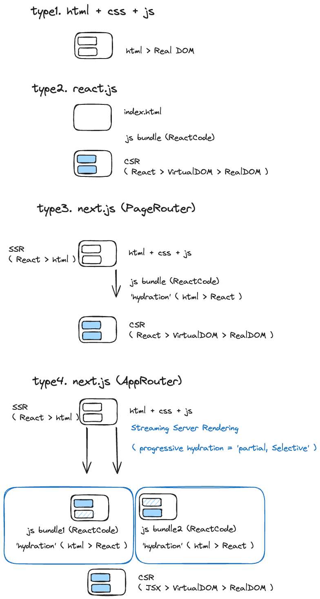
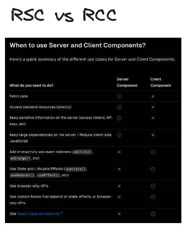
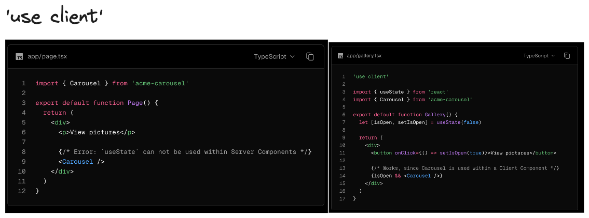

# 3.NextJS 핵심 개념 (이론)


## Goal

- 랜더링 변천사 이해하기  
- TailwindCSS 기초 학습하기  

### 복습 포인트

- 프로젝트에 딱 필요한 TailwindCSS 정리 
- 신호등 픽토그램 스스로 구현 


## 3.1 HTML+CSS+JS vs React.js vs Next.js 차이점

HTML + CSS + Vanilla JS:
- 기본기 > 작은 프로젝트나 간단한 웹 페이지
- 단일 페이지 애플리케이션(SPA)을 구축 어렵
- 결과물 : HTML + CSS + JS
- 장점 : 가장 빠르다 
  - but, 큰 프로젝트 개발이 어렵다.  

React:
- SPA ( Single Page Application , Angular, Vue, React - 현재 FE 개발 트렌드, Svelte)
- 페이스북에서 만든 JavaScript 라이브러리
- 언제 사용 ? : SEO 상관없는 인터렉션이 많은 모든 웹 ( 어드민 페이지, B2B 페이지, Gmail, 지도 앱)
- 결과물 : JS 정적 파일 (+html, css)  
- 장점 : 웹에서 앱처럼 UI상호작용이 가능한 웹사이트 개발 가능, 
  - but, SEO 불리 및 초기 JS로딩이 느리다. ( 빈 화면 보임 ) 

Next.js:
- MPA ( Mutiple Page Application )
- React 기반의 서버 사이드 렌더링(SSR) 및 정적 사이트 생성(Static Site Generation, SSG)을 지원하는 프레임워크입니다.  
- 언제사용 ? :
  - SEO 최적화
  - 초기 로딩 속도 향상 > B2C  
- FullStack 가능 ( 서버 API, DB 조회 등 )
- 결과물 : 서버 Application ( + html 정적 파일)
  - but, 웹 + 서버 전반의 지식 필요 

## 3.2 랜더링 종류 - CSR, SSR, Hydration




Streaming Server Side Rendering : Page를 부분적으로 나누어서 SSR을 진행 후, 완성되는 순서대로 사용자 화면에 뿌려준다.  
- Progressive Hydration : 이는 점진적인 hydration 과정이 필요함    
- Selective Hydration : 우선순위가 높은 UI 먼저 hydration  
- Partial Hydration : 일부분만 hydration 진행  
- *전체 페이지를 쪼개서 각자의 랜더링을 싸이클이 진행될 수 있는 이유는 React Suspense 덕분.   

### 더 알아보기

[브라우저의 렌더링 과정](https://medium.com/%EA%B0%9C%EB%B0%9C%EC%9E%90%EC%9D%98%ED%92%88%EA%B2%A9/%EB%B8%8C%EB%9D%BC%EC%9A%B0%EC%A0%80%EC%9D%98-%EB%A0%8C%EB%8D%94%EB%A7%81-%EA%B3%BC%EC%A0%95-5c01c4158ce)  
- 브러우저의 랜더링 과정을 이해하고 설명해보기  

[nextjs 공식 문서 - streaming](https://nextjs.org/learn/dashboard-app/streaming#streaming-a-component)   
- 핵심은 다음 2가지 입니다.!  

```
There are two ways you implement streaming in Next.js:  
1.At the page level, with the loading.tsx file.
2.For specific components, with <Suspense>.
```

## 3.3 컴포넌트 종류 - RSC, RCC, use client

### Goal

- RSC,RCC 2개 비교하기  
- 서버 컴포넌트, 클라이언트 컴포넌트는 각각 언제 사용하는가?  
- 'use client'의 진정한 의미    




### 더 알아보기
[When to use Server and Client Components?](https://nextjs.org/docs/app/building-your-application/rendering/composition-patterns#when-to-use-server-and-client-components)


## 3.4 React Suspense ( Streaming, Progressive Hydration )


*Selective Hydration을 가능하게 만드는 핵심 

서버 컴포넌트에서의 React Suspense
- 서버에서 데이터를 불러오는 작업이 끝나기 전에 클라이언트에게 서버 렌더링된 마크업을 전송할 수 있습니다. 
- 초기 로딩 시간을 최적화하고 사용자 경험을 향상시킬 수 있습니다.

```jsx
import { Suspense } from 'react'
import { PostFeed, Weather } from './Components'
 
export default function Posts() {
  return (
    <section>  
      <Suspense fallback={<p>Loading feed...</p>}>
        <PostFeed />
      </Suspense>
      <Suspense fallback={<p>Loading weather...</p>}>
        <Weather />
      </Suspense>
    </section>
  )
}
```
 
클라이언트 컴포넌트에서의 React Suspense
- 비동기적으로 데이터를 불러오는 동안 사용자에게 로딩 상태를 표시
- fallback 컴포넌트를 렌더링할 수 있습니다. 
- 이는 주로 lazy loading이나 동적으로 불러오는 컴포넌트에서 유용합니다.

```jsx
// 클라이언트 컴포넌트에서의 예시
import { lazy, Suspense } from 'react';

const LazyLoadedComponent = lazy(() => import('./LazyLoadedComponent'));

function ClientComponent() {
  return (
    <Suspense fallback={<div>Loading...</div>}>
      <LazyLoadedComponent />
    </Suspense>
  );
}

export default ClientComponent;
```


### 더 알아보기

[Streaming with Suspense](https://nextjs.org/docs/app/building-your-application/routing/loading-ui-and-streaming#example)  
[pageRouter vs appRouter 비교](https://www.jadru.com/diffrent-approuter-and-pagerouter)  
[How are Client Components Rendered?](https://nextjs.org/docs/app/building-your-application/rendering/client-components#how-are-client-components-rendered)  
- FullPage Loading vs Subsequent Navigations  
[Dynamic Routes, Generating Static Params, Parallel Routes, Intercepting Routes](https://nextjs.org/docs/app/building-your-application/routing/dynamic-routes#generating-static-params)  
[New Suspense SSR Architecture in React 18](https://github.com/reactwg/react-18/discussions/37)   

## 3.5 TailwindCSS 정리1

### playground

아래 사이트에서 연습이 가능하다.  
- https://play.tailwindcss.com/


### 단위체계

tailwind css 에서는 rem 단위를 사용한다.  
- 1은 0.25 rem, 4는 1rem 이다. 
- 디폴트 값으로 1rem은 16px이다. 
- 고정된 px단위도 사용 가능하다.  

```js
# gap-1 은 0.25rem 만큼 떨어진다. 
# px단위는 []을 이용해서 사용한다.  
<div class="flex flex-row gap-1 gap-[5px]">
  <div>1</div>
  <div>2</div>
  <div>3</div>
</div>

```

## 3.6 TailwindCSS 정리2


### bg, border, border-color, rounded

```js
className="bg-red-200"
className="bg-red-200 bg-opacity-50"
className="border border-solid border-red-300"
className="border-2 border-red-300"
className="rounded-full"
className="border border-transparent rounded-full"
className="cursor-pointer rounded-full hover:opacity-75 transition"

eg)
<div class="h-40 w-40 cursor-pointer rounded-full border border-transparent bg-red-200 transition-colors hover:bg-red-300"></div>

```
### w, h, p, m 

```js
# extrinsic 
className="h-auto h-5 h-[40px]"
# intrinsic - 내부 요소에 의해 크기 결정
className="h-fit h-min h-max"
className="w-auto w-full w-5 w-[40px]"
className="p-8 p-[40px] px-8 py-8"
className="m-8 m-[40px] mx-8 my-8"
```

### text-color, text-size, font-bold, cursor

```js
# color
className="text-green-500"

# font-size (text-sm, text-md, text-lg..)
className="text-sm text-md text-2xl text-[50px]"

# weight, font-bold(700)
className="font-medium font-[500] font-bold font-[700]"

className="cursor-pointer"
```

### flex, flex-col, justify, items, gap

```js
# display:flex
className="flex"

# justify-content(main-axis)
className="flex justify-between"

# align-items(cross-axis)
className="flex items-center"

# direction
className="flex flex-row"
className="flex flex-col"

# gap
className="flex flex-col gap-y-4"

# flex:1 1 0%
className="flex flex-1"

# eg)
<div class="flex flex-row items-center justify-between gap-[5px]">
  <div>1</div>
  <div>2</div>
  <div>3</div>
</div>
```


### hover, transition, :disabled

```js
className="transition"
className="hover:text-white"
className="disabled:cursor-not-allowed disabled:opacity-50"
```


### eg) Next Image + gradient

```js
const Header = () => {
  return (
    <div className="w-full h-[400px] relative">
      <Image
        alt="MediaItem "
        className="object-cover"
        fill
        src={
          "https://images.unsplash.com/photo-1707833558984-3293e794031c?q=80&w=2033&auto=format&fit=crop&ixlib=rb-4.0.3&ixid=M3wxMjA3fDB8MHxwaG90by1wYWdlfHx8fGVufDB8fHx8fA%3D%3D"
        }
      />
      <div className="w-full h-full bg-black opacity-40 absolute top-0"></div>
      <div className="w-full h-full absolute top-0 bg-gradient-to-t from-black"></div>
    </div>
  );
};

```

## 3.7 TailwindCSS 정리3 - 예제


### eg) 픽토그램 - 신호등, 횡단보드 

```js
<!-- eg) 픽토그램 - 신호등, 횡단보드  -->

<div class="group flex h-[250px] w-full flex-row items-center justify-between bg-black">
  <div class="flex flex-row gap-4 group-hover:bg-pink-300">
    <div class="h-[150px] w-4 bg-white"></div>
    <div class="h-[150px] w-4 bg-white"></div>
    <div class="h-[150px] w-4 bg-white"></div>
    <div class="h-[150px] w-4 bg-white"></div>
    <div class="h-[150px] w-4 bg-white"></div>
  </div>
  <div class="flex flex-row items-center justify-center gap-3">
    <div class="h-40 w-40 rounded-full border-2 border-white bg-red-400 transition hover:bg-red-200"></div>
    <div class="h-40 w-40 rounded-full border-2 border-white bg-yellow-400 transition hover:bg-yellow-200"></div>
    <div class="h-40 w-40 rounded-full border-2 border-white bg-green-400 transition hover:bg-green-200"></div>
  </div>
  <div class="flex flex-row gap-4 group-hover:bg-yellow-300">
    <div class="h-[150px] w-4 bg-white"></div>
    <div class="h-[150px] w-4 bg-white"></div>
    <div class="h-[150px] w-4 bg-white"></div>
    <div class="h-[150px] w-4 bg-white"></div>
    <div class="h-[150px] w-4 bg-white"></div>
  </div>
</div>
```


