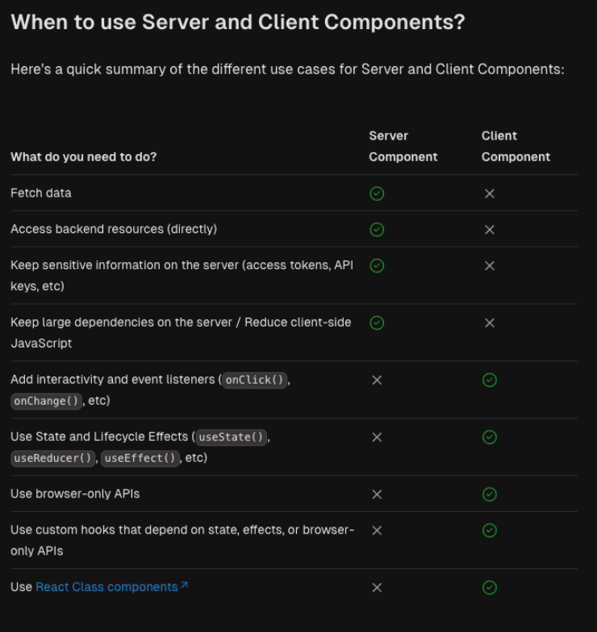

# 4.NextJS AppRouter

## Goal

- meta, favicon
- appRouter 디렉터리 구조 잡기 
- page, params, searchParams
- group folder
- loading, error, layout
- rootLayout 성능 개선하기  

### 복습 포인트

- appRouter 디렉터리에서 사용되는 특수파일들 정리 하기
- appRouter 디렉터리 구조 잡기   


## 4.1 meta, favicon

### 더 알아보기 - 메타데이터의 3종류

- https://nextjs.org/docs/app/building-your-application/optimizing/metadata#static-metadata  

Static Metadata  
Dynamic Metadata  
File-based metadata  
- favicon.ico, apple-icon.jpg, and icon.jpg  
- opengraph-image.jpg and twitter-image.jpg  
- robots.txt  
- sitemap.xml  


## 4.2 page, params, searchParams

### 설명해보기 

- params(Dynamic Routes) vs searchParams    


### 더 알아보기  

[Dynamic Routes](https://nextjs.org/docs/app/building-your-application/routing/dynamic-routes)

## 4.3 group folder

group folder   
- app router에서는 디렉터리 구조에 따라서 앱의 URL에 따른 페이지가 결정된다.  
- 그룹 폴더는 페이지 경로에 영향을 미치지 않고 폴더를 정리하고 싶을 떄 사용 한다.  

### 더 알아보기 

[nextjs RouteGroup](https://nextjs.org/docs/app/building-your-application/routing/route-groups)

## 4.4 layout file

### 더 알아보기

Root Layout vs Nesting Layouts

[pages-and-layouts](https://nextjs.org/docs/app/building-your-application/routing/pages-and-layouts#layouts)

## 4.5 loading, error

### 설명해보기  

- 서버 컴포넌트 아닌 경우 로딩 에니메이션이 안나오는 이유  

### 더 알아보기

특수 파일들 : https://nextjs.org/docs/getting-started/project-structure#routing-files 




## 4.6 rootLayout 에서 피해야 할 것

RootLayout의 지연은 전체 App의 느려지는 현상으로 번진다.  


### 성능테스트 해보기  
```
case1  
root 4s + home 2s - 4s   
case2  
root 2s + home 4s -> 2s -> home loading... 2s -> home page
case3
root 4s + home 2s - 4s -> home page
```

