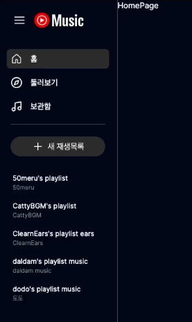
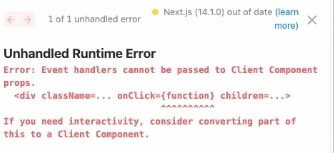

# 5. NextJS Sidebar

## Goal
- 더미 데이터를 셋팅 합니다.  

### 복습 포인트

SideBar 컴포넌트 직접 만들어 보기    

## 5.1 더미 데이터 넣기

아래 깃허브 저장소를 참고한다.  
- https://github.com/dodokyo/yt-music-clone  
- git clone을 받자.!  
- public의 로고, 이미지, 음악 파일을 복사한다.   

*위 디렉터리 + 파일들을 넣어주세요.!  

## 5.2 Sidebar

## 5.3 Sidebar > Logo

### 설명하기  

왜 아래 오류가 나왔을까요? 해결 방법은요?  

## 5.4 Sidebar > Navigator

## 5.5 Sidebar > PlayList

## 완료된 코드  

https://github.com/dodokyo/yt-music-clone/tree/ch5-done