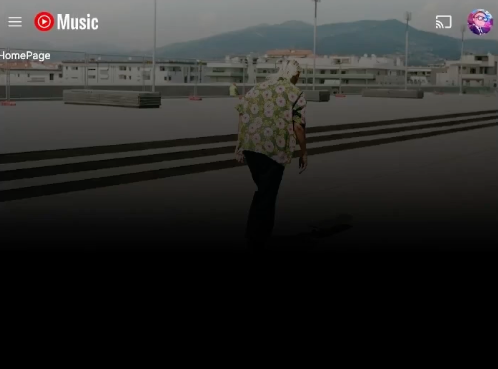
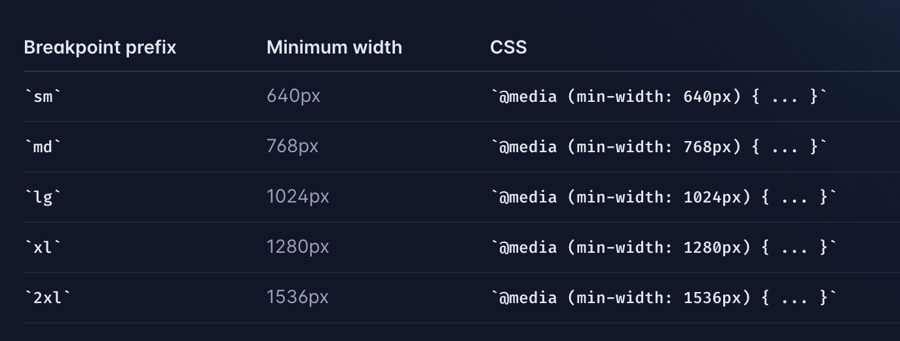

# 6. NextJS Header 


## Goal

- Shadcn CLI Install 
- CSS Position relative,absoulte  
- TailwindCss 반응형 디자인 방법  
- useState > Drawer 상태관리
- useEffect > 스크롤 이벤트 감지  

### 복습 포인트

  
1.Header 컴포넌트 만들기  


  
2.Drawer Header 컴포넌트 만들기  


## 6.1 Header

### 설명하기 

랜더링 순서 : rootLayout vs layout vs page 

## 6.2 Header > bg

### 더 알아보기 - CSS Position relative,absoulte / CSS의 z-index 속성 이해하기

https://www.daleseo.com/css-z-index/  
https://creamilk88.tistory.com/197  

## 6.3 Shadcn CLI Install
https://ui.shadcn.com/docs/components/avatar

## 6.4 relative, absoulte, sticky, padding


### 설명하기

CSS Position (relative, absolute,...) 에 따른 화면이 그려지는 순서    

Ref   
- https://www.daleseo.com/css-z-index/    
- https://creamilk88.tistory.com/197    

## 6.5 TailwindCss 반응형 디자인 방법


https://tailwindcss.com/docs/responsive-design

## 6.6 Header > search

## 6.7 Header > 반응형 만들기1

## 6.8 Header > 반응형 만들기2

## 6.9 Header > 반응형 만들기3


### 고도화 - 스크롤 이벤트에 디바운싱 걸기  

힌트 :  

디바운싱은 이벤트 핸들러가 연속적으로 발생하는 경우, 일정 시간 동안 마지막 이벤트만 처리하도록 하는 기술입니다. 이를 통해 성능을 최적화하고 불필요한 작업을 방지할 수 있습니다. useEffect 훅을 사용하여 스크롤링 이벤트에 디바운싱을 적용하는 예제를 보여드리겠습니다.

```javascript
import React, { useState, useEffect } from 'react';

function ScrollComponent() {
  const [scrollY, setScrollY] = useState(0);

  useEffect(() => {
    const handleScroll = () => {
      // 스크롤 위치를 업데이트합니다.
      setScrollY(window.scrollY);
    };

    const debouncedHandleScroll = debounce(handleScroll, 200); // 디바운싱 적용

    window.addEventListener('scroll', debouncedHandleScroll);

    return () => {
      // 컴포넌트가 언마운트되면 이벤트 리스너를 제거합니다.
      window.removeEventListener('scroll', debouncedHandleScroll);
    };
  }, []); // useEffect의 두 번째 매개변수로 빈 배열을 전달하여 한 번만 실행되도록 설정합니다.

  // 스크롤 위치를 화면에 표시합니다.
  return (
    <div>
      <p>현재 스크롤 위치: {scrollY}px</p>
      {/* 여기에 다른 컴포넌트 및 내용 추가 가능 */}
    </div>
  );
}

// 디바운싱 함수
function debounce(func, wait) {
  let timeout;
  return function executedFunction(...args) {
    const later = () => {
      timeout = null;
      func(...args);
    };
    clearTimeout(timeout);
    timeout = setTimeout(later, wait);
  };
}

export default ScrollComponent;
```

이 예제는 스크롤 위치를 추적하고, 스크롤 이벤트가 발생할 때마다 스크롤 위치를 갱신합니다. 그러나 디바운싱 함수를 통해 스크롤 이벤트 핸들러가 호출되는 속도를 제어하여 성능을 최적화합니다.


## 체크포인트 코드  

https://github.com/dodokyo/yt-music-clone/tree/ch6-done