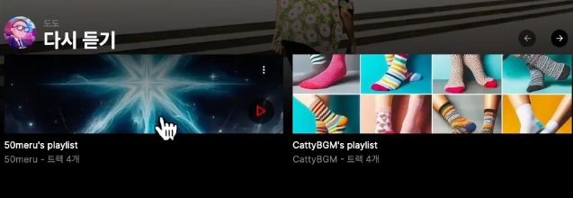

# 7.YTMusicClone - Home 

## Goal

- Zustand 사용 목적과 기초 사용법을 배웁니다.   
- Carousel 컴포넌트 사용법을 배웁니다.  


### 복습 포인트

  
1.Category 컴포넌트를 강의를 보지 않고 만들어 보기  
- zustand로 카테고리 상태관리를 합니다.  
- UI디자인은 완성된 Demo를 참고해도 좋아요.  

  
2.PlayListCareusel 컴포넌트를 직접 만들기어 봅니다.    
3.PlayListCareusel > PlayListCard 컴포넌트를 직접 만들어 봅니다.  


## 7.1 zustand 에 대해서

zustand github : https://github.com/pmndrs/zustand  

### 📌 면접 연습 - 언제 전역상태 상태를 써야 할까요?

리액트에서 클라이언트 상태관리는 로컬(useState) 혹은 전역(zustand) 를 이용해 볼 수 있습니다.  
- 언제 전역상태 상태를 써야 할까요?  
- context API 만으로 상태관리를 하면 어떤가요?  

참고  
- https://velog.io/@cada/React-Redux-vs-Context-API#redux%EC%99%80-context-api%EC%9D%98-%EC%B0%A8%EC%9D%B4-%EF%B8%8F


### 📌 면접 연습 - Zustand 상태관리 라이브러리  

- Zustand 상태관리 라이브러리의 내부 동작에 대해 아는대로 말해주세요.  
  - 왜 Context Provider를 안써도 될까요?  
- Redux, Recoil과 차이점, 장단점이 있을까요?  

참고   
- https://ui.toast.com/posts/ko_20210812
- https://www.nextree.io/zustand/  


## 7.2 zustand home 카테고리 

```js
import { create } from "zustand";

const useUIState = create((set) => ({
  homeCategory: "",
  headerImageSrc:
    "https://images.unsplash.com/photo-1707833558984-3293e794031c",
  setHomeCategory: (value) => set({ homeCategory: value }),
  setHeaderImageSrc: (src) => set({ headerImageSrc: src }),
}));

export default useUIState;

```

## 7.3 PlayListCarousel 및 타이핑

## 7.4 PlayListCarousel - 1

https://ui.shadcn.com/docs/components/carousel


## 7.5 PlayListCard - 1


### 설명하기 : 클라이언트 컴포넌트에서 사용할 수 있는 훅

useRouter  
useParams  
usePathname  
useSearchParams   
- 위 훅들의 차이점은 무엇인가요?


## 7.6 PlayListCard - 2

## 체크포인트 코드  

https://github.com/dodokyo/yt-music-clone/tree/ch7-done