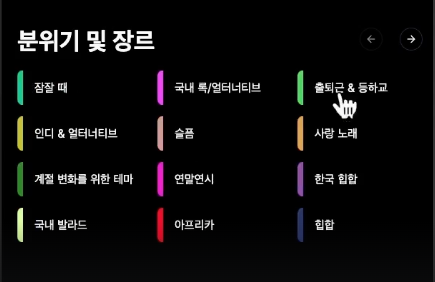

# 8.YTMusicClone - Explore 

## Goal

- explore 페이지 완성  

### 복습 포인트

  
1.반응형 카테고리 메뉴 만들기  

  
2.PlayList > 재사용 컴포넌트 사용하기  

   
3.SongListCarousel 만들기  

  
4.GenreListCarousel 만들기  

## 8.1 Category

## 8.2 PlayListCarousel

## 8.3 song card - 1

## 8.4 song card - 2

## 8.5 Rank - Layout bugFix-1

## 8.6 song card - 3

## 체크포인트 코드  

https://github.com/dodokyo/yt-music-clone/tree/ch8-done