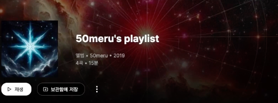

# 10.YTMusicClone - Playlist

## Goal

- Playlist 페이지 완성  

### 복습 포인트

1.PlayList > Header 컴포넌트 만들기  

  
2.SongCardRowExpand 컴포넌트 만들기  

## 10.1 permanentRedirect vs router hook

### 설명하기 

경로재설정을 서버에서 하는 것과 클라이언트에서 하는 것 차이 그리고 방법에 대해서 설명하기  

참고  
- https://nextjs.org/docs/app/api-reference/functions/redirect
- https://nextjs.org/docs/app/api-reference/functions/use-router  

## 10.2 HeaderBgChanger

### 고도화    

HeaderBgChanger라는 useEffect 함수로 클라이언트 랜더링 처리로 배경을 바꿔야 하는가 ?  
애초에 서버 컴포넌트에서 처리할 수 있는 부분이 아닌가 ?  
어떻게 개선할 수 있는가 ?  

## 10.3 Header

## 10.4 Header 반응형

## 10.5 SongList

## 10.6 SongList Link

## 체크포인트 코드  

https://github.com/dodokyo/yt-music-clone/tree/ch10-done