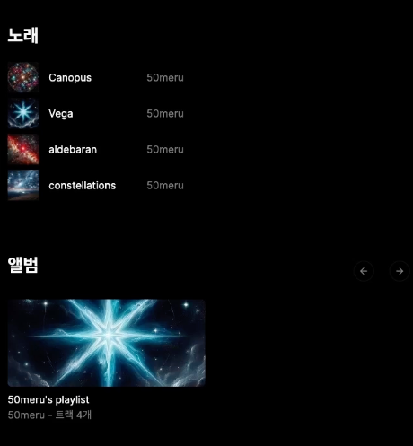

# 11.YTMusicClone - Channel

## Goal
- Channel 페이지 완성  

### 복습 포인트

  
1.컴포넌트 제작     


  
2.컴포넌트 재사용하여 UI 만들기  

## 11.1 빌드 오류 수정

### 📌 디버깅 연습 - ref가 변할 가능성

#### Code1.
```js
  useEffect(() => {
    const handleScroll = () => {
      const scrollValue = headRef.current?.scrollTop;
      setIsScrolled(scrollValue !== 0);
    };

    headRef.current?.addEventListener("scroll", handleScroll);
    return () => {
      // warning message : The ref value 'headRef.current' will likely have changed by the time this effect cleanup function runs. If this ref points to a node rendered by React, copy 'headRef.current' to a variable inside the effect, and use that variable in the cleanup function.eslintreact-hooks/exhaustive-deps
      headRef.current?.removeEventListener("scroll", handleScroll);
    };
  }, []);
```

#### Code2.

```js
  useEffect(() => {
    const currentHeadRef = headRef.current;

    const handleScroll = () => {
      const scrollValue = currentHeadRef?.scrollTop;
      setIsScrolled(scrollValue !== 0);
    };

    currentHeadRef?.addEventListener("scroll", handleScroll);
    return () => {
      currentHeadRef?.removeEventListener("scroll", handleScroll);
    };
  }, []);
```

질문  
- code1에서 warning이 나왔습니다.
- code2로 리팩토링 이후 warning이 사라졌어요.  
- 그 이유를 말해주세요.  
- warning message : The ref value 'headRef.current' will likely have changed by the time this effect cleanup function runs. If this ref points to a node rendered by React, copy 'headRef.current' to a variable inside the effect, and use that variable in the cleanup function.eslintreact-hooks/exhaustive-deps

힌트 
- 이 경고는 React에서 렌더링된 노드를 가리키는 ref가 변할 가능성이 있음을 알려줍니다. 이를 해결하기 위해 effect 내부에서 'headRef.current' 값을 변수에 복사하고 그 변수를 cleanup 함수에서 사용하세요. 이렇게 하면 eslintreact-hooks/exhaustive-deps 경고를 피할 수 있습니다.


### 📌 면접 연습 - react key props

질문  
- react 에서 map을 순회하여 컴포넌트를 랜더링 할 때 key값을 넘겨야 하는 이유를 설명해주세요.


힌트  

- React에서 map을 사용하여 컴포넌트를 렌더링할 때 key 속성을 제공해야 하는 이유는 다음과 같습니다:
1. **성능 최적화**: ? 
2. **상태 유지**: ? 
3. **독립적인 엘리먼트**: ? 


---
참고 : GPT의 답변  
1. **성능 최적화**: key는 React가 엘리먼트를 식별하는 데 사용됩니다. key를 제공하면 React가 각 항목을 고유하게 식별하고 변경된 요소만 다시 렌더링할 수 있습니다. 이렇게 하면 React가 전체 목록을 다시 렌더링하는 대신 변경된 요소만 업데이트하므로 성능이 향상됩니다.
2. **상태 유지**: key를 제공하지 않으면 React는 컴포넌트를 재사용하거나 갱신하지 않고 새로운 요소로 인식합니다. 따라서 컴포넌트의 상태가 보존되지 않고 다시 생성될 수 있습니다. 이는 사용자 입력에 따라 상태를 잃어버리거나 불필요하게 컴포넌트를 다시 렌더링할 수 있습니다.
3. **독립적인 엘리먼트**: 각 엘리먼트에 고유한 key를 제공하면 React가 이를 독립적인 요소로 취급합니다. 이는 컴포넌트에 대한 식별자로 사용되므로 React가 정확히 어떤 요소가 변경되었는지 파악할 수 있습니다.

따라서 React에서 map을 사용하여 동적으로 컴포넌트를 생성할 때는 각 컴포넌트에 고유한 key를 제공하여 성능을 최적화하고 상태를 유지하는 것이 중요합니다.


### Note) tsx 타이핑 예  

```tsx
import React, { useState } from 'react';

interface CounterProps {
  initialValue: number;
  stringValue: string;
  booleanValue: boolean;
  children: React.ReactNode;
}

interface CounterState {
  count: number;
  message: string;
  isActive: boolean;
}

const Counter: React.FC<CounterProps> = ({ initialValue, stringValue, booleanValue, children }) => {
  const [count, setCount] = useState<CounterState['count']>(initialValue);
  const [message, setMessage] = useState<CounterState['message']>(stringValue);
  const [isActive, setIsActive] = useState<CounterState['isActive']>(booleanValue);

  const increment = () => {
    setCount(count + 1);
  };

  const decrement = () => {
    setCount(count - 1);
  };

  const toggleActive = () => {
    setIsActive(!isActive);
  };

  return (
    <div>
      <button onClick={increment}>Increment</button>
      <span>{count}</span>
      <button onClick={decrement}>Decrement</button>
      <div>
        <span>Message: {message}</span>
      </div>
      <button onClick={toggleActive}>Toggle Active</button>
      <div>
        <span>Active: {isActive ? 'Yes' : 'No'}</span>
      </div>
      {children}
    </div>
  );
};

export default Counter;
```

## 11.2 SSR - getPlaylistById

## 11.3 Channel Header


## 11.4 Button.tsx Typing

## 11.5 Channel 노래,앨범 section


### Note) ReactElement vs ReactNode vs JSX.Element
https://velog.io/@hanei100/ReactElement-vs-ReactNode-vs-JSX.Element#reactelement-vs-reactnode-vs-jsxelement


## 체크포인트 코드  

https://github.com/dodokyo/yt-music-clone/tree/ch11-done 